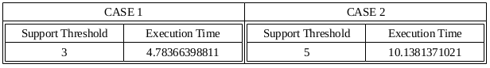
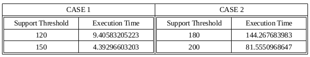
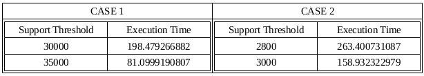

## SON Algorithm

### Execution Syntax
- spark-submit Vishal_Seshagiri_SON.py <case-number> <path-to-csv-file> <support-threshold-value>

### Observed execution times

#### For Small2.csv

#### For ml-latest-small/ratings.csv renamed to MovieLens.Small.csv

#### For ml-20m/ratings.csv renamed to MovieLens.Big.csv

### Spark Version => 2. 2. 1 
### Approach followed to implement the algorithm => Apriori Algorithm